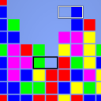

swapper
=======

Tile swapper game executable and component libraries.

For more info visit http://www.efanomars.com/games/swapper

This source package contains:

- libstmm-swapper:
    library containing swapper specific events

- libstmm-swapper-xml:
    library that extends the xml game definition "language"
    to instantiate events defined in libstmm-swapper

- swapper:
    the game executable of swapper features
    - multiple players collaborating or competing
    - the original blob game

Read the INSTALL file for installation instructions.

Warning
-------
The APIs of the libraries aren't stable yet.
